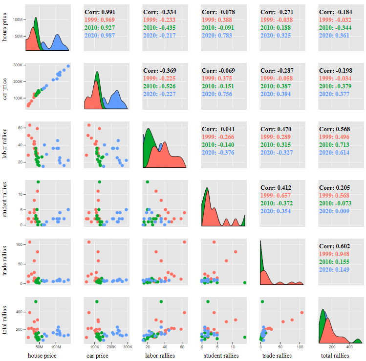

# Splom chart with diagonal area chart


## how to use
can use chart in html or npm

### HTML
Add the following code to the html body
> Note: `<script src="data.js"></script>` is sample data.

```html
<div id="splom"></div>
<script src="data.js"></script>
<script src="bundle.js"></script>
<script>
    var fileds = ["house_price", "car_price", "labor_rallies", "student_rallies", "trade_rallies", "total_rallies"]
    var labels = ["house price", "car price", "labor rallies", "student rallies", "trade rallies", "total rallies"]
    var categoryColor = ["#ff7062", "#00a82d", "#609dfe"]

    new splom.buildSplom('splom', {
      data: dataAll,
      options: {
        fileds: fileds,
        labels: labels,
        categoryColor: categoryColor,
        categoryField: 'year'
      }
    })
</script>
```
- **fileds**: key json data for use in chart
- **labels**: The display name of the field in the chart
- **categoryField**: categorys of the field
- **categoryColor**: The display color of the field category in the chart
### NPM
```sh
npm i splom
```
``` javascript
import { buildSplom } from 'splom';

var fileds = ["house_price", "car_price", "labor_rallies", "student_rallies", "trade_rallies", "total_rallies"]
var labels = ["house price", "car price", "labor rallies", "student rallies", "trade rallies", "total rallies"]
var categoryColor = ["#ff7062", "#00a82d", "#609dfe"]

new buildSplom('splom', {
  data: dataAll,
  options: {
    fileds: fileds,
    labels: labels,
    categoryColor: categoryColor,
    categoryField: 'year'
  }
})
```

## Example
can use Example chart in the dist folder
> Note: **index-fa.html** is for persian language

